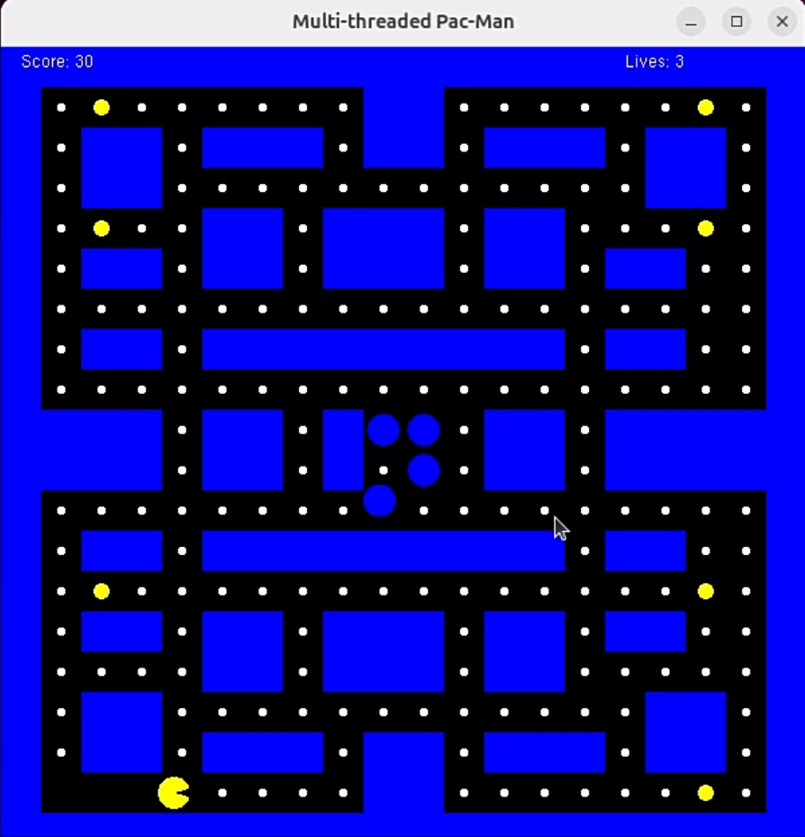
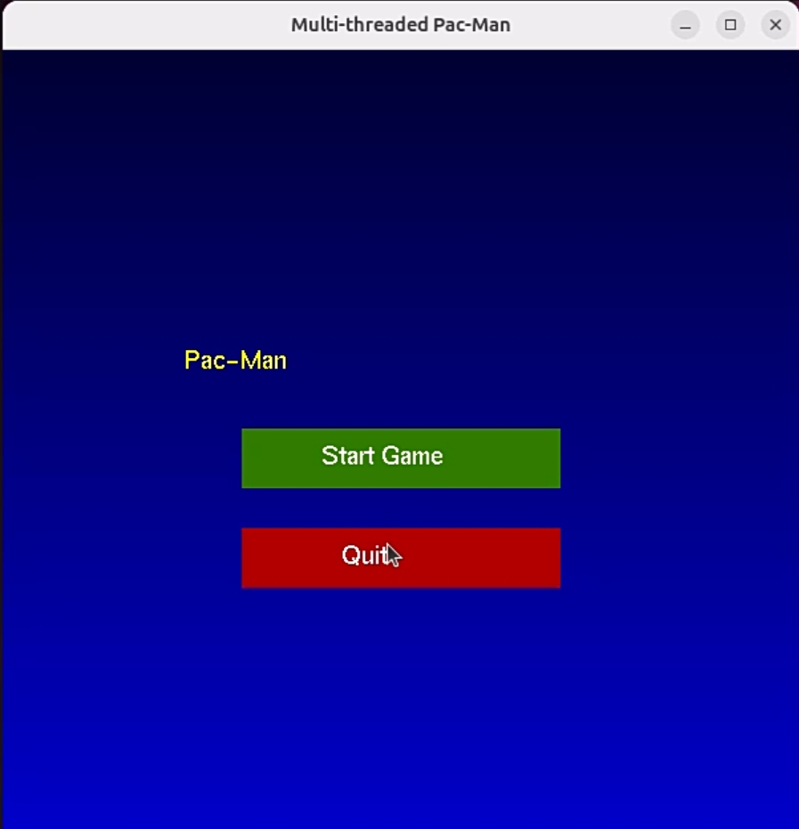
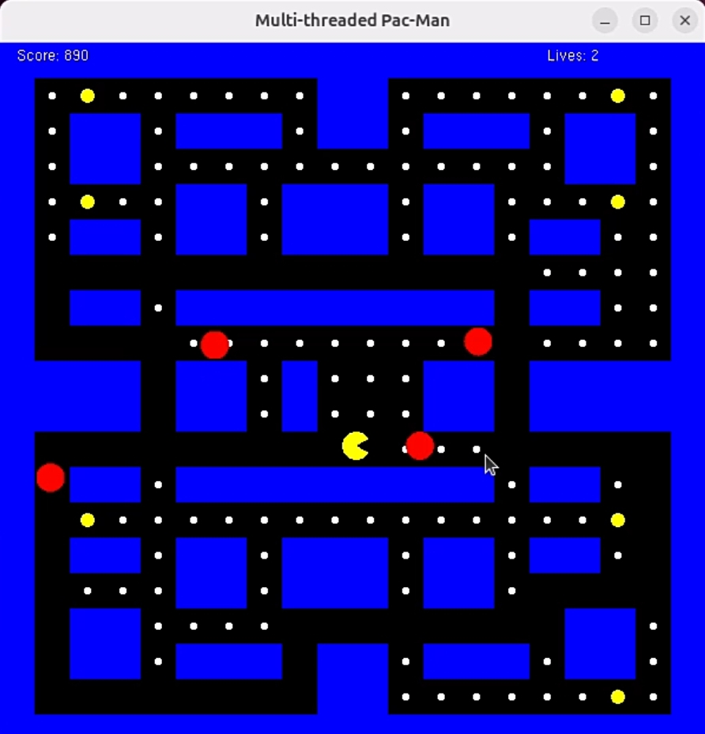
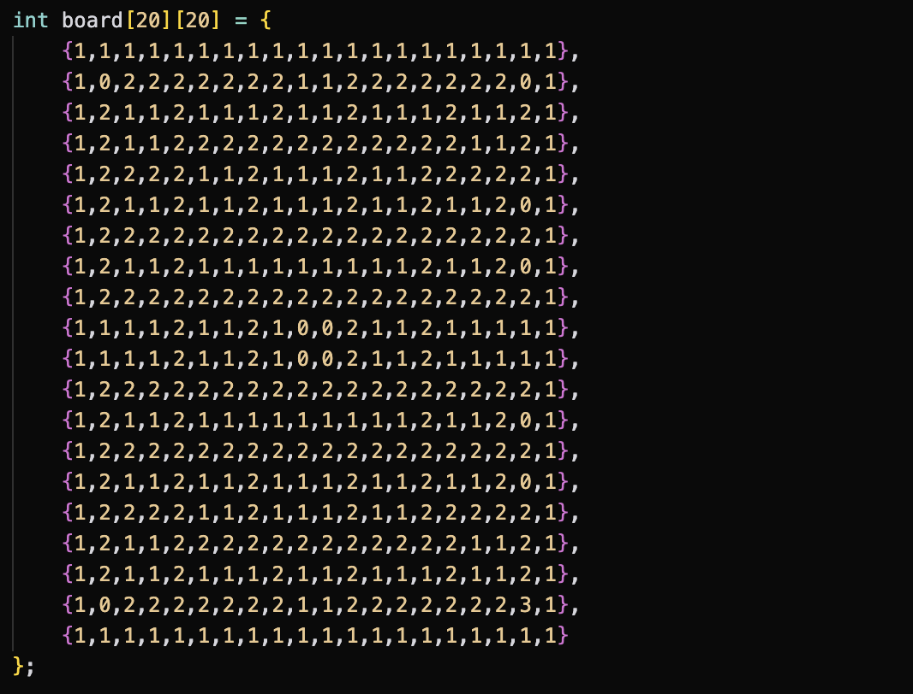
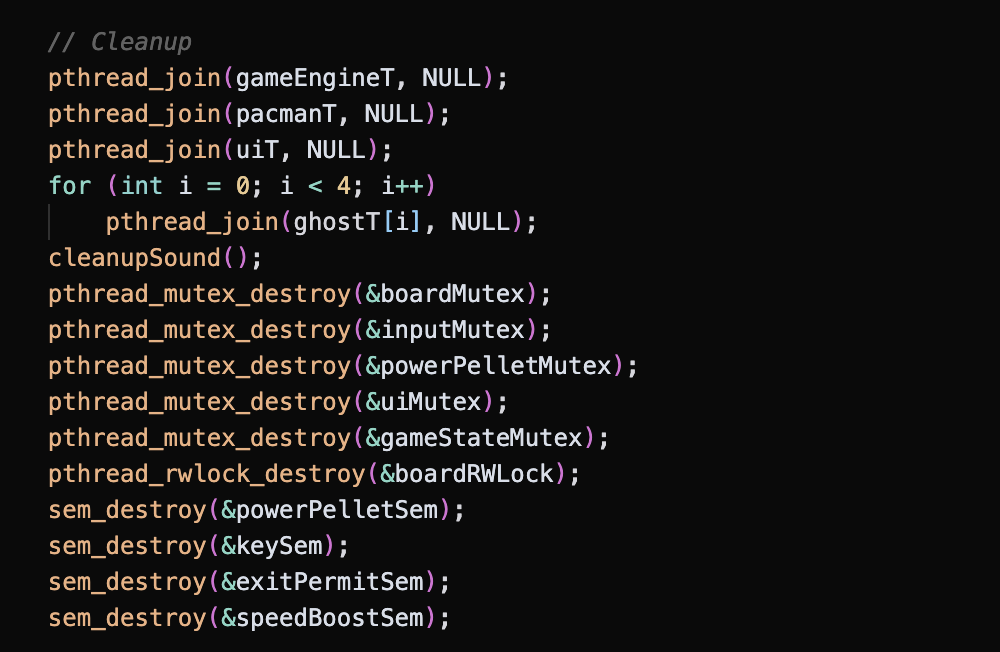
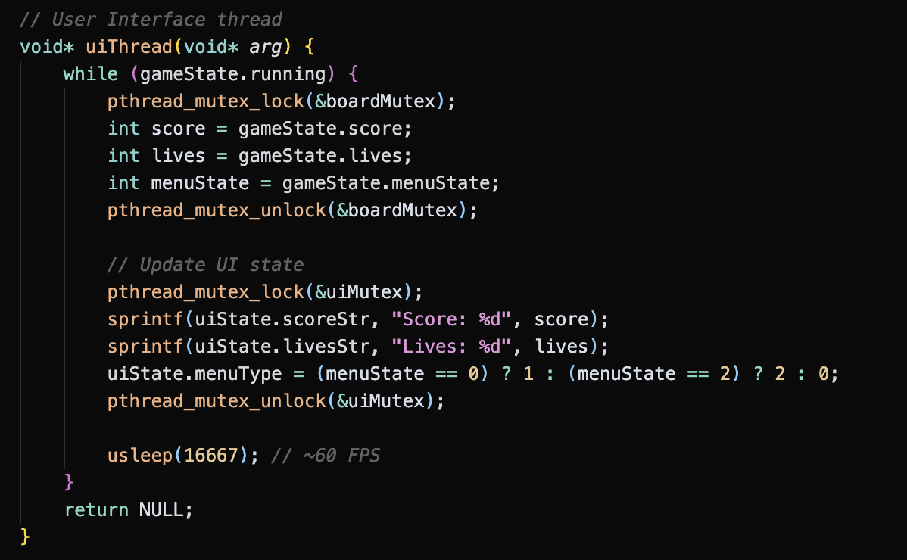
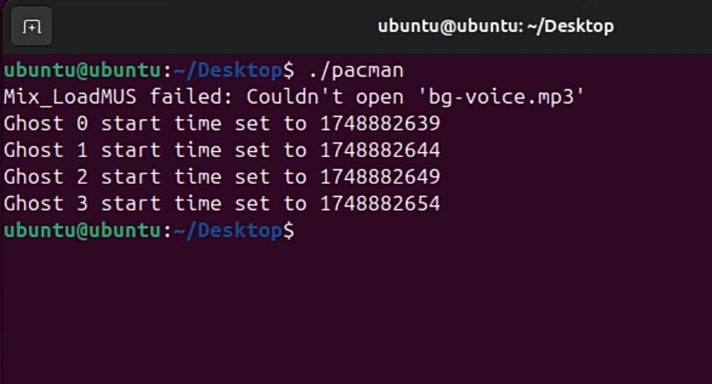

# Multi-threaded Pac-Man Game 🎮

<div align="center">
  
### 🌟 Check out the project showcase on LinkedIn! 🌟
<a href="https://www.linkedin.com/posts/saadabdullah786_pacman-operatingsystems-gamedevelopment-activity-7342557549025542144-m7Dq" target="_blank" rel="noopener noreferrer">
  
</a>

---

</div>

A modern implementation of the classic Pac-Man game using C, OpenGL, and multi-threading concepts. This project demonstrates advanced programming concepts including thread synchronization, mutex locks, semaphores, and real-time game mechanics.



## 🌟 Features

- **Multi-threaded Architecture**
  - Separate threads for game engine, Pac-Man animation, ghosts, and UI
  - Thread-safe game state management
  - Synchronized resource access using mutex locks and semaphores

- **Modern Graphics**
  - OpenGL-based rendering
  - Smooth animations
  - Interactive UI elements with hover effects
  - Dynamic game board rendering

- **Game Mechanics**
  - Classic Pac-Man gameplay
  - Power pellets and ghost state management
  - Score tracking and lives system
  - Collision detection
  - Ghost AI with random movement patterns

- **Audio Integration**
  - Background music support using SDL2_mixer
  - MP3 audio playback

## 🎯 Gameplay

### Start Menu
The game begins with an attractive start menu featuring animated title text and interactive buttons.



### Main Game
Navigate Pac-Man through the maze, collect pellets, and avoid ghosts!



### Code Architecture
The game is built with a robust multi-threaded architecture:

#### Main Game Board


#### Thread Management


#### UI System


## 🚀 Setup and Installation

### Prerequisites
- OpenGL
- GLUT (OpenGL Utility Toolkit)
- SDL2 and SDL2_mixer
- C compiler (gcc recommended)
- pthread library

### Installation Steps

1. Clone the repository:
```bash
git clone [repository-url]
cd pacman
```

2. Install dependencies (Ubuntu/Debian):
```bash
sudo apt-get update
sudo apt-get install libgl1-mesa-dev freeglut3-dev
sudo apt-get install libsdl2-dev libsdl2-mixer-dev
```

3. Compile the game:
```bash
gcc pacman.c -o pacman -lGL -lGLU -lglut -lSDL2 -lSDL2_mixer -lpthread -lm
```

4. Run the game:
```bash
./pacman
```

## 🎮 Controls

- **Arrow Keys**: Move Pac-Man
- **P**: Pause game
- **R**: Restart game
- **Q**: Quit game
- **Mouse**: Menu interaction

## 🔧 Technical Details

### Thread Synchronization
- Mutex locks for game state protection
- Read-write locks for board access
- Semaphores for power pellet management
- Input queue with mutex protection

### Memory Management
- Dynamic resource allocation
- Proper cleanup on game exit
- SDL2 resource management

## 🤝 Contributing

Feel free to fork this project and submit pull requests. For major changes, please open an issue first to discuss what you would like to change.

## 📝 License

This project is licensed under the MIT License - see the LICENSE file for details.

## �� Connect & Share

- <a href="https://github.com/yourusername/pacman" target="_blank" rel="noopener noreferrer">GitHub Repository</a>
- <a href="https://yourportfolio.com" target="_blank" rel="noopener noreferrer">Portfolio</a>

## 📸 Additional Screenshots

### Terminal Output


---

Made with ❤️ by [Saad Abdullah]

*Note: This project was developed as part of an Operating Systems course demonstration of multi-threading concepts.* 